# mavenflix-analytics

## 1. Subscription Status Distribution

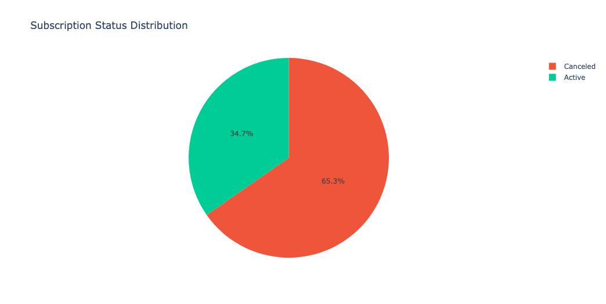

**Interpretation:**
Out of all subscriptions, 65.3% have been canceled while only 34.7% remain active. For every 3 customers who signed up, 2 have already left.

**Insight:**
The business has a retention problem. Majority of customers do not stay.

**Evidence:**
- 65.3% canceled vs 34.7% active shown in pie chart

---

## 2. Monthly New Subscriptions

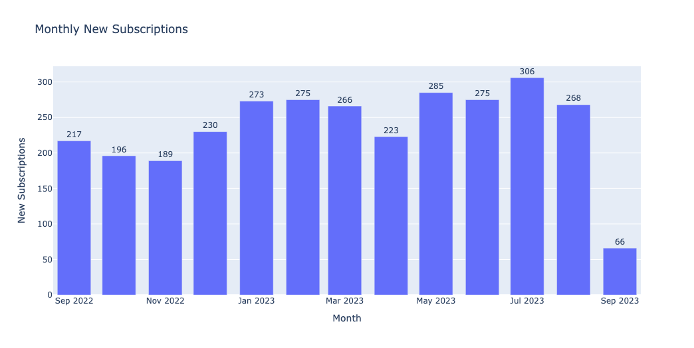

**Interpretation:**
New subscriptions ranged from 189 (Nov 2022) to 306 (Jul 2023). There is a clear improvement in acquisition from late 2022 to mid 2023. September 2023 shows only 66 because the month is incomplete.

**Insight:**
Customer acquisition improved in 2023. July 2023 was the peak month.

**Evidence:**
- Nov 2022: 189 (lowest full month)
- Jul 2023: 306 (highest)
- Average increased from ~200 in late 2022 to ~275 in mid 2023

---

## 3. Monthly Cancellations

**Interpretation:**
Cancellations grew from 33 (Sep 2022) to 225 (Jul 2023). The number increased almost 7x over the year. Peak cancellations occurred in Mar 2023 (224), Jul 2023 (225), and Aug 2023 (219).

**Insight:**
Churn got worse over time, not better. The business is losing more customers each month as the customer base grows.

**Evidence:**
- Sep 2022: 33 cancellations
- Jul 2023: 225 cancellations
- Consistent 200+ cancellations from Mar 2023 onwards

---

## 4. New Subscriptions vs Cancellations

**Interpretation:**
Blue bars (new subscriptions) are always higher than red bars (cancellations), meaning the business is still growing. However, the gap between them is narrowing over time.

**Insight:**
Growth is positive but slowing. Cancellations are catching up with new signups.

**Evidence:**
- Sep 2022: 217 new vs 33 canceled (gap = 184)
- Aug 2023: 268 new vs 219 canceled (gap = 49)

---

## 5. Monthly Net Subscriber Change

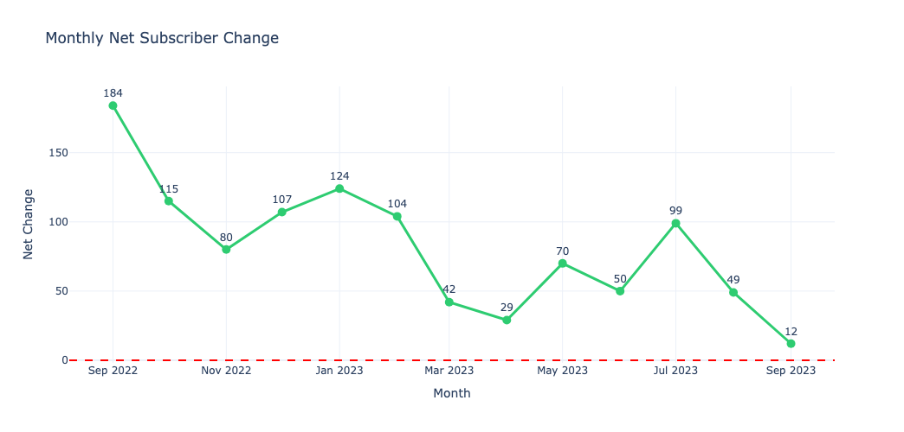

**Interpretation:**
Net change (new minus canceled) started at +184 in Sep 2022 and dropped to +12 by Sep 2023. The trend line shows a clear downward pattern with some fluctuations.

**Insight:**
The business is still adding customers but at a much slower rate. If this trend continues, net growth could turn negative.

**Evidence:**
- Sep 2022: +184
- Apr 2023: +29 (lowest point)
- Sep 2023: +12
- All values above zero but declining

---

## 6. Cumulative Net Subscriber Growth

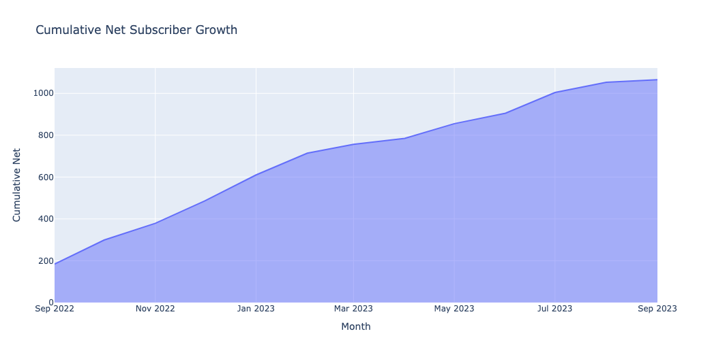

**Interpretation:**
Total active subscriber base grew from ~200 to ~1065 over the year. The curve is flattening towards the end, indicating slower growth.

**Insight:**
The business 5x its subscriber base in one year, which is positive. But the flattening curve signals growth is decelerating.

**Evidence:**
- Steep curve Sep 2022 to Jan 2023
- Flatter curve from May 2023 onwards

---

## 7. Customer Longevity Distribution

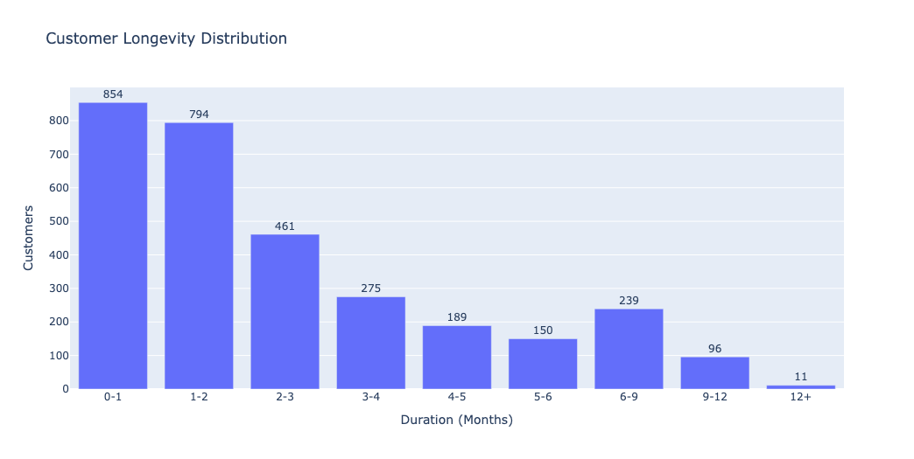

**Interpretation:**
854 customers stayed 0-1 months. 794 stayed 1-2 months. Numbers drop sharply after that. Only 11 customers reached 12+ months.

**Insight:**
Most customers leave early. 54% churn within the first 2 months. This is an onboarding or value problem.

**Evidence:**
- 0-1 months: 854
- 1-2 months: 794
- Total first 2 months: 1648 out of 3069 = 54%
- 12+ months: only 11

---

## 8. Subscription Duration Distribution (Histogram)

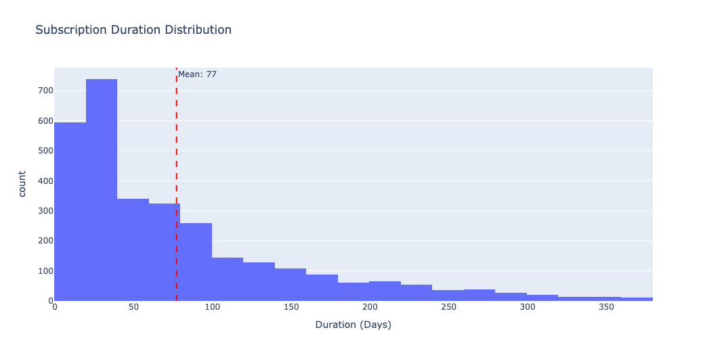

**Interpretation:**
The histogram is heavily right-skewed. Most subscriptions cluster between 0-100 days. Mean duration is 77 days (~2.5 months). Very few subscriptions last beyond 200 days.

**Insight:**
The average customer stays about 2.5 months. Half leave even sooner than that.

**Evidence:**
- Peak frequency at 20-50 days
- Mean: 77 days (red dashed line)
- Long tail towards 350+ days but very few customers

---

## 9. Subscription Duration by Status (Box Plot)

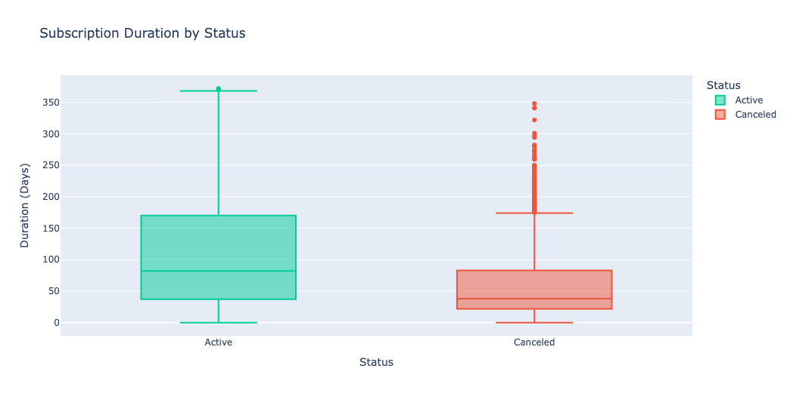

**Interpretation:**
Active customers have higher median duration (~90 days) with wider spread (up to 365 days). Canceled customers have lower median (~40 days) with many outliers who stayed longer before canceling.

**Insight:**
Customers who are still active have been around longer on average. Those who canceled typically left within the first 1-2 months.

**Evidence:**
- Active median: ~90 days
- Canceled median: ~40 days
- Canceled box is compressed lower, showing early churn

---

## 10. Subscription Status by Payment

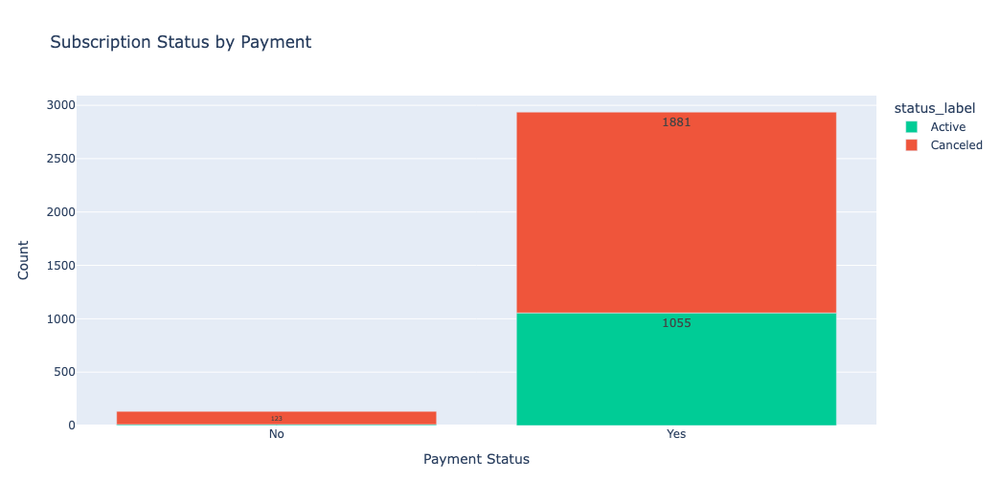

**Interpretation:**
Of 2936 paid subscriptions, 1055 are active and 1881 are canceled. Of 133 unpaid subscriptions, almost all (123) are canceled.

**Insight:**
Payment failure leads to almost certain churn. But even among paid customers, 64% still canceled. Payment is not the main churn driver.

**Evidence:**
- Paid: 1881 canceled out of 2936 = 64% churn
- Unpaid: 123 canceled out of 133 = 92% churn
- Unpaid is worse, but paid still has high churn

---

## 11. Month-over-Month Retention Rate

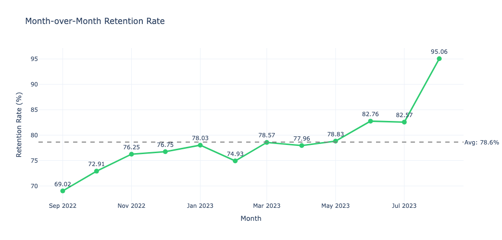

**Interpretation:**
MoM retention started at 69% (Sep 2022) and improved to 95% (Aug 2023). Average is 78.6%. There was a dip in Feb 2023 (74.93%) before recovery.

**Insight:**
Retention is improving over time. The business is getting better at keeping customers from one month to the next.

**Evidence:**
- Sep 2022: 69.02%
- Aug 2023: 95.06%
- Upward trend with average at 78.6%

---

## 12. Month-over-Month Churn Rate

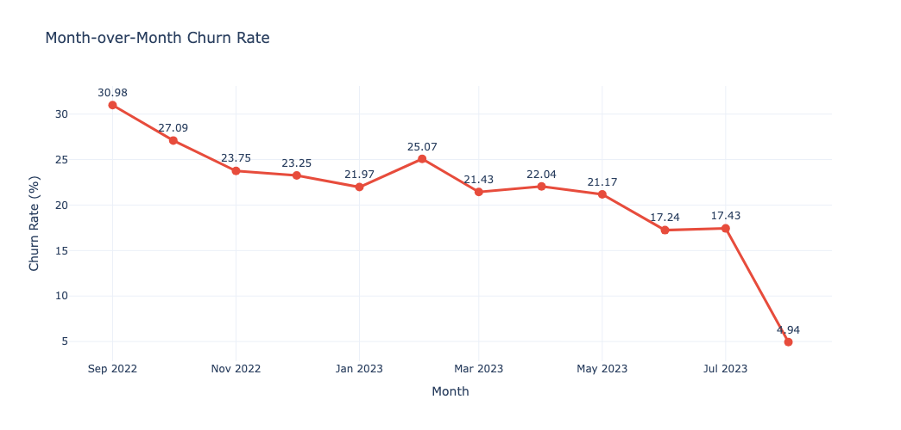

**Interpretation:**
MoM churn started at 31% (Sep 2022) and dropped to 5% (Aug 2023). Peak churn was Feb 2023 (25%). Overall trend is downward.

**Insight:**
Churn is reducing. Whatever the business did from mid-2023 onwards is working.

**Evidence:**
- Sep 2022: 30.98%
- Aug 2023: 4.94%
- Clear downward trend

---

## 13. Monthly Retained vs Churned Customers

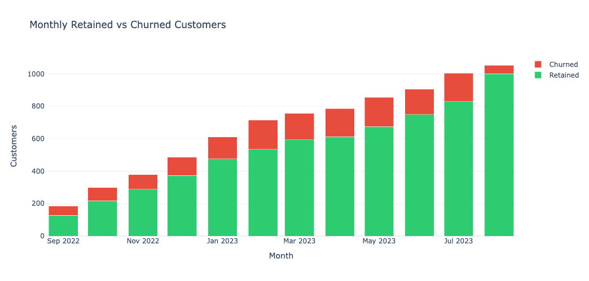

**Interpretation:**
Green bars (retained) are growing while red bars (churned) remain relatively stable. The proportion of red is shrinking over time.

**Insight:**
As the customer base grows, a higher percentage is being retained each month. The red portion getting smaller confirms improving retention.

**Evidence:**
- Sep 2022: Red portion is significant (~30%)
- Aug 2023: Red portion is smaller (~5%)

---

## 14. Cohort Month-over-Month Retention Heatmap

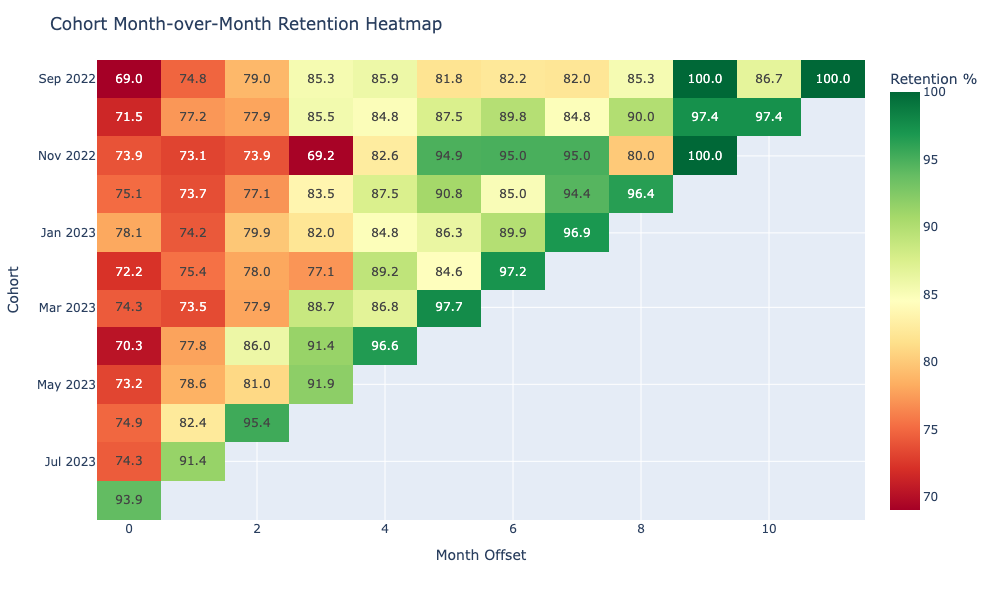

**Interpretation:**
Each row is a cohort (signup month). Each column is months after signup. Values show % retained from one month to the next.

- First column (offset 0) shows first month retention: ranges from 69% to 93.9%
- Later columns show stabilization around 80-100%
- Red cells (low retention) cluster in offset 0 and 1 for older cohorts
- Green cells (high retention) appear more in newer cohorts and later offsets

**Insight:**
- First month is the danger zone. All cohorts lose 6-31% of customers in month 0.
- Newer cohorts (May 2023 onwards) have better first-month retention.
- Once customers survive 3-4 months, retention stabilizes above 85%.

**Evidence:**
- Sep 2022 cohort, offset 0: 69% (worst)
- Aug 2023 cohort, offset 0: 93.9% (best)
- Offset 6+ columns are mostly green (85%+)

---

## Key Findings Summary

| Finding | Evidence |
|---------|----------|
| High overall churn (65.3%) | Status distribution chart |
| Early churn is critical | 54% leave within 2 months (longevity chart) |
| First month retention is weakest | Heatmap shows 69-94% at offset 0 |
| Retention is improving | MoM retention grew from 69% to 95% |
| Growth is slowing | Net change dropped from +184 to +12 |
| Payment is not the main issue | 64% of paid customers still churned |

---

## Recommendations

1. **Focus on first 60 days** — Most churn happens here. Improve onboarding, engagement, and perceived value in the first 2 months.

2. **Investigate Feb-Mar 2023 dip** — Retention dropped during this period. Understand what caused it to prevent recurrence.

3. **Replicate mid-2023 success** — Retention improved significantly from Jun 2023. Identify what changed and scale it.

4. **Target at-risk customers early** — Use duration and engagement data to predict churn and intervene before month 2.

5. **Address payment failures** — 92% of unpaid subscriptions churn. Implement payment retry and recovery flows.

